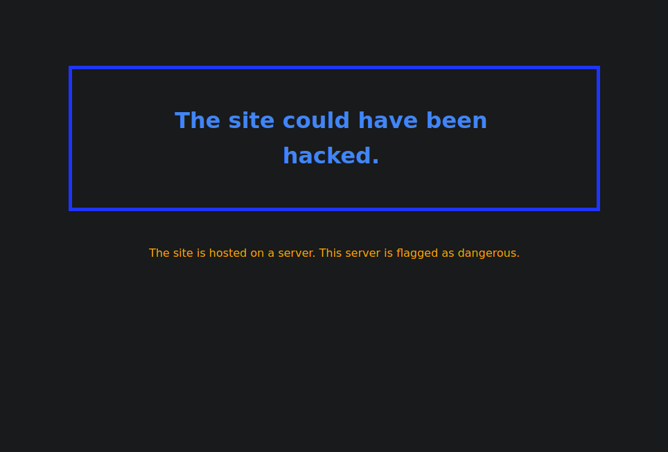

# Spot & Block

  	
This originally was my CS50 Final Project, it is an answer to this academical exercise. It is a proof-of-work of a possible future browser extension for Chromium-Based Browsers (e.g. Google Chrome, Brave, etc).

This extension improves user privacy and security online. It protects them from malicious sites they could visit by blocking different harmful functionalities.

## How the Extension Works

This extension operates by ranking visited sites in terms of harmfulness (Spot) and blocking them accordingly (Block).

**Fetching website data:** The program uses different services to acquire information about the visited website and the server hosting it. This information is obtained through API calls, its services are limited (read section 1.1 for complete explanation).

**Spot:** To describe the potential damage a website could do, this extension sorts the site in one of these three categories: _low-risk_, _medium-risk_ or _critical-risk_ according to certain website's features. There are default recommended settings (all customizable by the user as desired) to accomplish this sorting of the website’s harm potential.

**Block:** Once sorted, this extension triggers blocking actions in order to protect the user. The actions' toughness depends on the website's category of harmfulness. Each category has default recommended blocking actions (all customizable).

## Features
- Simple to use: Made for a user with no technical background.
- Relevant and innovative methods to determine the site's harmfulness.
- Various configurable options to determine how dangerous a site is and what the extension should block from it.
- Many site-blocking features (e.g Blocking cookies, deleting storage when leaving the page, blocking the javascript, blocking the site all together, etc).

- Optimized to run the fastest way possible.

## Installation

The extension installation is done from the project's source code (in the src folder).

### To install in the Chrome browser:

Open your Chrome Browser and go to the Extensions page. To do this, follow the click sequence (1), (2) then (3) on the image below:

As shown on the image below, toggle the Developer mode on (1), then click on the 'Load unpacked' button (2). On the 'Select the extension directory' window that just opened, select the src folder of this project (3) and click OK (4).

The extension is fully installed!

### To install in the Brave browser:

Open your Brave Browser and go to the Extensions page. To do this, follow the click sequence (1), (2) on the image below:

As shown on the image below, toggle the Developer mode on (1), then click on the 'Load unpacked' button (2). On the 'Select the extension directory' window that just opened, select the src folder of this project (3) and click Select (4).

The extension is fully installed!

## User Interface

### Pop-up

The user can access the extension's popup in the browser's toolbar by clicking on the extension icon.

The user can see if the extension is enabled for the visited site, the risk category to which the site was matched and the protective actions that are activated (on green).

To disable the extension for the visited website, the user can click on the "activated/deactivated" button (see the green "Activated button" on the image).

The user can activate/deactivate additional blocking actions by clicking on their respective button on the pop-up.

### Settings page

This page allows the user to configure the criteria for each risk category (Spot) and the protective actions taken for each scenario (Block).

The user will find the explanation for each action and criteria in this settings page.

The settings page is divided into four sections:

- Basic Options
- Advanced Spot Options
- Advanced Block Options
- Advanced Timing Options

**There are default values**: A default value has been attributed to each option, but the user can change them in the boxes to the right, granted that they click on the save button before exiting the settings page.

The Advanced Spot Options **can be configured** for each risk category. The settings open when you click any risk-level tab:

In the country and territory Spot option, by clicking the link 'as written here', you can access the webpage that includes the exact spelling of the Countries and Territories supported for geolocation. This opens the following webpage (here partially shown):

The Advanced Block Options **can be configured** for each risk category too. Same as above, the settings open when you click any risk-level tab:

### Intercepting page

This page is shown to the user when one of the site's blocking features closes a website. It explains to the user why the visited site was closed.

## Developer's note
Brief explanation of the technical extension details.

### Fetching the website's information 

#### APIs services

This extension relies on the service of four different APIs: [shodanAPI](https://www.shodan.io/), [virusTotalAPI](https://www.virustotal.com/gui/) , [BigDataCloudAPI](https://www.bigdatacloud.com/)  and [CirclCveAPI](https://cve.circl.lu/) . 
The shodanAPI is essential for the execution of the extension. Whereas, the other three are complementing spotting services. 

##### [shodanAPI](https://www.shodan.io/): 
 I chose to make the shodanAPI (from Shodan.io) the basis on this extension's functions because it provides crucial data for the risk classification of the websites:  _the server IP's CVEs, open ports, tags and location_. Another advantage is that it provides a free service for the development of tech products through an API key that they offer to the user. Thus, the proof-of-work code as you see it, works solely with the API key included in the shodan.js file (pinpointed with a comment in the code) which pertains to the free Shodan service  that includes 10,000 requests/month (figure obtained at the date of the publication of this file). For this reason, the extension with the included API key is an answer to the academic exercise of the CS50 final project. 
 Nonetheless, if the development of the extension were to be considered to aim at a use of a bigger public, each user would need their own API key, by subscribing directly to the free or the paid membership of the shodanAPI services for their personal use (refer to www.shodan.io). 
 

##### [virusTotalAPI](https://www.virustotal.com/gui/) 
This API service fetches the information that regards the _antivirus report_ of the visited website. 
This API service also depends on the use of an API key that is obtained through the free services of virusTotal. The virusTotal API key is included in the virusTotal.js file (pinpointed with a comment in the code). This API key gives us access to 500 requests per day at a maximum rate of 4 requests per minute (figures obtained at the date of the publication of this file). The information that is provided by virusTotal is used for some of the spotting criteria, it is important but not crucial. Since this service imposes a limited rate and is not essential, this program considers that in the event that the information needed from virusTotal is not obtained at the moment of the request, the classification could be completed with the other criteria by bypassing the antivirus information.
If the development of the extension were to be considered to aim at a use of a bigger public, each user would need their own API key, by subscribing directly to the free or the paid membership of the virusTotalAPI services for their personal use (refer to www.virustotal.com/gui/). 

 
##### [BigDataCloudAPI](https://www.bigdatacloud.com/) 
This API is used to perform the _reverse geolocation of the IP's location._ This is a free service provided by BigDataCloud API that does not depend on a personal API key but that has a limited use of 10,000 requests per month (figure obtained at the date of the publication of this file). The reverse geolocation used to locate the server geographically is used as a spotting criteria but it is not crucial for this program. 
Since this service imposes a limited rate and is not essential, this program considers that when the request quota to BigDataCloud is exceeded, the classification could be completed with the other criteria by bypassing the geolocation. If you want to upgrade BigDataCloudAPI service with a paid subscription refer to www.bigdatacloud.com . 

 
##### [CirclCveAPI](https://cve.circl.lu/) 
This API is used to obtain the _CVSS of all of the server's CVEs._ This is a free service that does not have a limited quota of requests (data obtained at the date of the publication of this file). Thus, no subscription is necessary for its use. 

#### Regarding the use of this extension

With the current design of this program and its dependency on the API services mentioned above, I propose three uses according to the visit rate:

- **For the validation of this program (proof-of-work):** 
Currently, API keys have been included in the code to present the proof-of-work of this project. To run this academic exercise with the included keys, please use it in a moderate rate in order to avoid reaching the maximum requests quota of the shodanAPI key and the virusTotal API key (current request limits explained thoroughly above).

- **Limited personal program use:** 
If you intend to use this program in your personal browsing, you can use it with the free API services as long as you restrain the number of analyzed websites. To do that, create a [shodan](https://www.shodan.io/) and a [virustotal](https://www.virustotal.com/gui/) account. Then proceed to insert your [ shodan API key ]( https://developer.shodan.io/api/requirements ) as well as your [virustotal API key](https://www.virustotal.com/gui/my-apikey) in the extension's option page.

    I suggest using it only for websites deemed suspicious and not for your daily browsing in order to comply to the limits. One example of this use is doing your normal browsing with preferred browser without this extension and activating it in Brave (or Chrome) solely to navigate in deep waters (websites that seem suspicious).

- **Intensive use of this program:** 
 The optimal use of this extension would be for the user to acquire their exclusive API keys through the subscription of the Shodan, virusTotal and BigDataCloud paid services to upgrade the requests quotas. For example, this could be the case of a company that wants their employees to browse safely and that could afford those subscriptions. Please obtain the subscription information in each of the API services websites provided above. 

### Website categorization (Spot) according to its harmfulness potential

Three categories are used to value the website's harmfulness potential: low-risk, medium-risk or critical-risk.

In order to sort each visited website, the following parameters are evaluated:

#### The website's server vulnerabilities (CVEs)

- **CVSS**
  The assessment of the server's level of danger is obtained by gathering all of the server's CVEs and looking for the maximum CVSS value.
  CVSS default values were chosen from this article: ["Common Vulnerability Scoring System, V3.1: User Guide"](https://www.first.org/cvss/user-guide) First.org Inc.

- **CVE age**
  We look at the server's maximum CVE age.
  If there is a very old CVE it could mean that either the server has not been updated for a while or that the server is running deprecated software.

#### Website information reported by antiviruses

- **Number of antiviruses that detected something suspicious about the website**

- **Tag attributed to the website**
  We check if an antivirus flagged the site as either 'phishing', 'malware', 'malicious' or 'suspicious'.

#### Website's server Information

- **Attributed Tags**
  It is important to know if the server that hosts the website has one of the following tags: 'compromised', 'malware', 'doublepulsar' (a severe backdoor), 'honeypot' (a malicious server to trap hackers), 'tor' (the server also runs a tor service), 'self-signed' (the server has a self-signed ssl certificate: the site's legitimacy has not been checked by a third party) or 'vpn'.

- **Country location**
  It could be of interest to know if the server that is hosting the website is located in a specific country.
  There are no server location default values because this information could fluctuate. Take this article as an example: ["Countries with the highest malware rates of the first quarter of 2016."](https://www.statista.com/statistics/266169/highest-malware-infection-rate-countries/), Statista, Josep Johnson, Jan 25 2021.

- **Number of open ports**
  We want to determine if the server that is hosting the website has a large number of open ports.
  When a server runs more than one service, the complexity of that system increases, as do the attack surface and threat potential. The vulnerability to hacking attacks rises with the number of services offered by a server, according to the following article:  ["Belgium tops list of nations most vulnerable to hacking"](https://www.theguardian.com/technology/2016/jun/08/belgium-nations-vulnerable-hacking-exposed-servers-rapid7-heat-map-internet), The Guardian, Alex Hern, 8 Jun 2016.

To conclude about the categorization, Spot & Block uses many methods to get information about the site's risk potential. The more information the extension has about the site, the more accurate its risk classification is. But, it is important to note that not all the parameters are always available for each website (e.g. no server location information, or no antivirus service available at that moment). Therefore, this extension will use all available parameters to assess the site's harmfulness potential.

### Site blocking (Block)

After determining the risk associated with the site, certain features are blocked.
The default blocking setting for each risk category are customizable. When visiting a site, the user can interact with the popup to block additional features.

These features include:

#### Storage

For both cookies and other types of storage (such as cache, session, local and indexed Data Base storage), two possibilities are available: blocking and/or deleting the information when leaving the site.

#### Other

The site's javascript and the requests to third parties can be blocked to ensure additional safety.
Closing the site immediately is also an option.

### Application Design 📓

In this browser extension different tech features were used, here is a peek:

#### Programming language

The program is written in **javascript** (apart from a few html and css files).

#### Say no to frameworks

**No frameworks were used,** because any additional piece of software will increase the security risk.

#### The way the software is written

##### Stability

Possible extension breaks were considered when writing the code in order to improve the project's overall **stability**.

##### Code for the future

This project's **endurance** was kept in mind. The tools used in this project will guarantee that the future development of this proof-of-work could be possible even after a few years. Its easy-to-read code
will allow the open sourcing of this project.

### Disclaimer

#### Someone could track your IP address

The extension does all the API calls from your browser. If you are not hiding your IP address (by using a VPN), the sites to which the extension does the API calls may associate your IP address with all the domains and IPs you are contacting.
Tracking you would be perfectly possible but it would not be the most effective technique to do so for two major reasons:

1. If you use Google Chrome, Chrome OS, Apple devices and do not use a VPN, a lot of entities (e.g. Google, Apple, your Internet Service Provider ISP) can track your browser history much more precisely.
2. There are a lot of other techniques to track someone but these are not relevant because they are not implemented on a large scale. This problem could be fixed by making all requests from a central server. All associated IP addresses would then be the same.

#### Surpassing the API calls threshold

As discussed previously in this file, the extension relies on  API services. If you exceed the limit request quota of the services the extension's parsing of the website will not finish. Thus, a result will not be given for the site.

## Closing Words

This extension is a proof-of-work that answers the academical exercise that the CS50 final project represents. 

 I made a project in which I believe. I want in a future to continue the development of this extension to a fully independent extension that is not limited by restrictive third party services

Last but not least, I want to acknowledge the CS50 team because thanks to them I have discovered my great passion. It has truly defined my future.

Arturo Barazarte.
